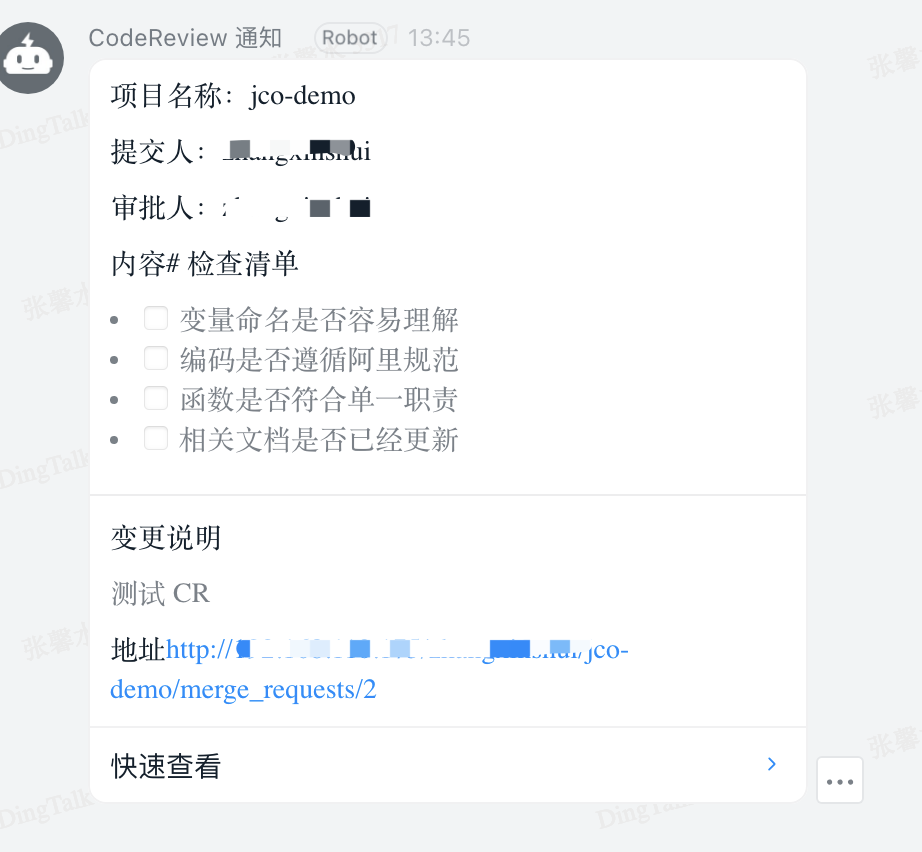
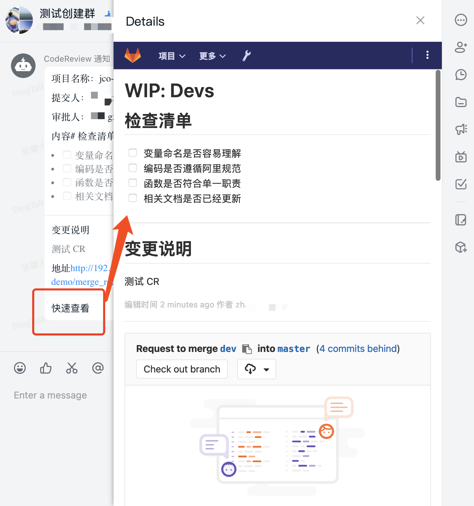

# gitlab 社区版 merge quest 钉钉通知中间件

# 介绍

作为一名代码评审员，我希望在有开发成员提交 Merge Request（MR）时，能在钉钉群里接受到 MR 通知。

# 部署 

 ```shell script
 java -jar gitlab-ce-code-review-notify-1.0.jar <port> <dingtalk robot url>
```
# 展示

钉钉样式


钉钉内部快速预览
